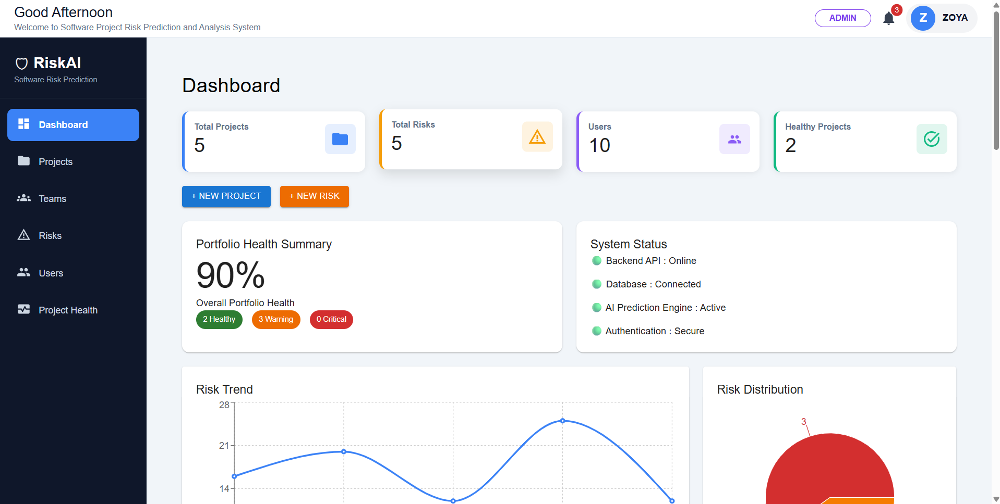
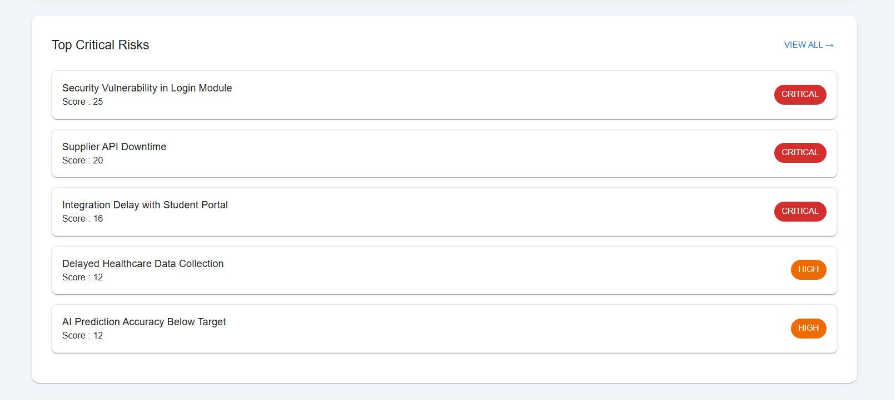
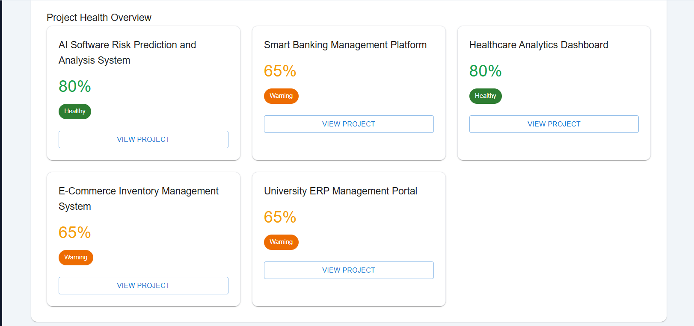
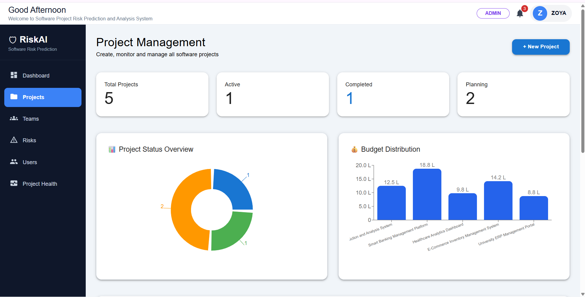
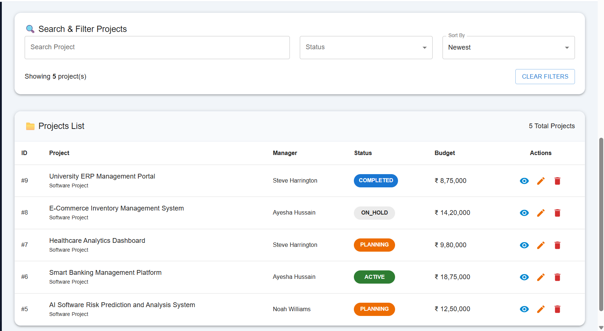
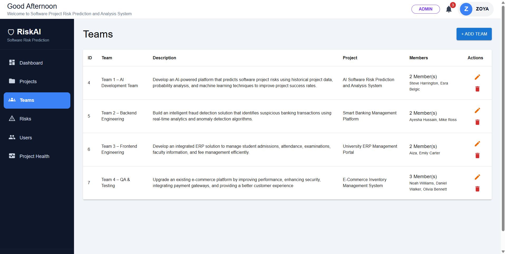
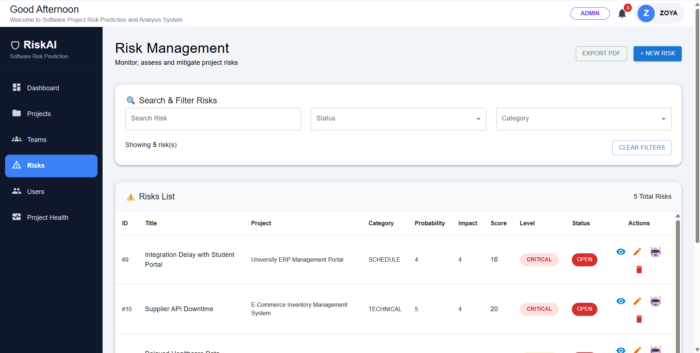
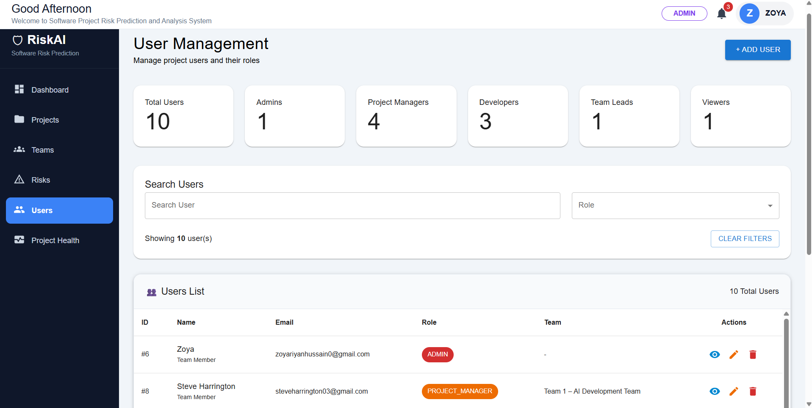
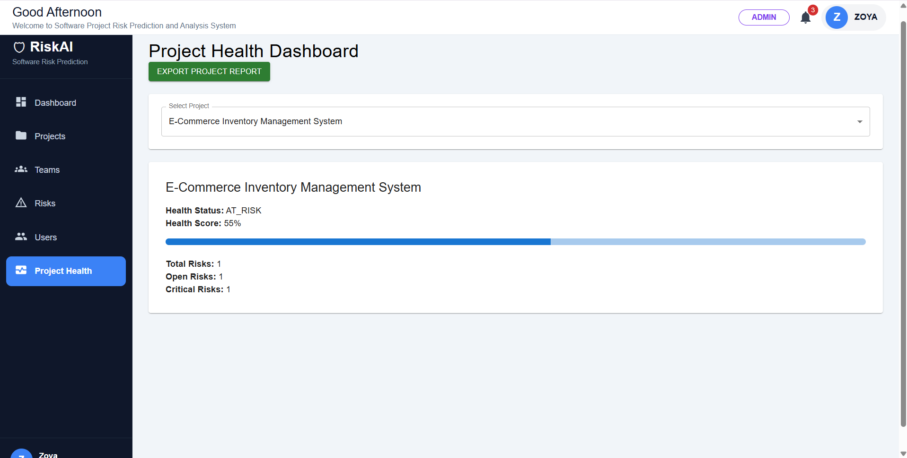

# RiskAI — Software Project Risk Prediction and Analysis System


A full-stack web application that helps project managers identify, assess, prioritize, and monitor software project risks through a centralized, interactive dashboard — with automatic risk scoring and project/portfolio health tracking.

🔗 **Live Demo:** Coming Soon
📂 **Repository:** [github.com/zoya-riyan-hussain](https://github.com/zoya-riyan-hussain)

---

## Screenshots

### Dashboard
Portfolio health, risk trend, risk distribution, system status, and AI-driven insights at a glance.



### Top Critical Risks & Project Health Overview
Quick view of the most severe open risks and per-project health scores.




### Project Management
Create, track, and monitor projects with budget distribution and status breakdown.




### Team Management
Organize teams, assign members, and link them to projects.



### Risk Management
Track, categorize, and score risks with automatic severity classification.



### User Management
Manage users and role-based access across the platform.



### Project Health Dashboard
Deep dive into a single project's health score, open risks, and critical risk count — exportable as a report.



---

## About the Project

Software projects often run into schedule delays, budget overruns, and quality issues because risks are tracked informally, or not tracked at all. RiskAI centralizes risk visibility for project managers — every risk is logged with a probability and impact score, automatically classified by severity (Low/Medium/High/Critical), and rolled up into project-level and portfolio-level health metrics so teams can prioritize what matters most.

This project was built as a solo project to strengthen full-stack development skills — covering REST API design, relational database design, role-based access, and real-time data visualization in a single enterprise-style application.

Note: Risk severity and health scores are currently calculated using a deterministic rule-based formula (Risk Score = Probability × Impact), not machine learning. The AI Insights & Recommendations panel uses rule-based logic on live data. ML-based prediction is listed under Future Enhancements.

---

## Features

### Dashboard
- Total Projects, Total Risks, Users, and Healthy Projects overview
- Portfolio Health Summary (Healthy / Warning / Critical breakdown)
- System Status Panel (Backend API, Database, AI Engine, Authentication)
- Risk Trend Line Chart & Risk Distribution Pie Chart
- AI Insights & Recommendations
- Top Critical Risks (score-based, top 5)
- Project Health Overview (per-project health cards)
- Quick Actions (New Project, New Risk)

### Project Management
- Create, view, edit, and delete projects
- Budget tracking with distribution charts
- Project status tracking (Planning / Active / On Hold / Completed)
- Project manager assignment
- Search, filter, and sort projects

### Risk Management
- Create, view, edit, and delete risks
- Risk categorization (Schedule, Technical, Quality, Resource, etc.)
- Probability & Impact based automatic scoring
- Automatic severity classification (Low/Medium/High/Critical)
- Risk status tracking (Open/Resolved)
- Search and filter risks
- Export risks to PDF

### Team Management
- Create and manage teams
- Assign team members and link teams to projects
- Track member count per team

### User Management
- User CRUD with role assignment (Admin, Project Manager, Developer, Team Lead, Viewer)
- Search and filter users by role

### Project Health Monitoring
- Per-project health score and status (Healthy / Warning / At Risk / Critical)
- Total Risks, Open Risks, and Critical Risks breakdown
- Exportable project health reports

---

## Technology Stack

**Frontend**
- React.js
- Material UI
- Recharts (charts & data visualization)
- Axios
- React Router
- Vite

**Backend**
- Java 17
- Spring Boot
- Spring Security
- Spring Data JPA / Hibernate
- REST APIs
- Maven

**Database**
- MySQL

**Tools**
- IntelliJ IDEA / VS Code
- Git & GitHub
- Postman

---

## Project Structure

```
software-risk-prediction-system
│
├── riskanalysis                 # Spring Boot Backend
│   ├── src/main/java/...        # Controllers, Services, Repositories, Entities
│   └── src/main/resources/      # application.properties, config
│
├── riskanalysis-frontend        # React Frontend
│   ├── src/components/          # Reusable UI components
│   ├── src/pages/                # Dashboard, Projects, Risks, Teams, Users, Project Health
│   └── src/services/             # Axios API calls
│
├── screenshots
│
├── LICENSE
│
└── README.md
```

---

## Installation & Setup

### Prerequisites
- Java 17+
- Node.js 18+
- MySQL 8.0+
- Maven

### 1. Clone the repository
```bash
git clone https://github.com/zoya-riyan-hussain/software-risk-prediction-system.git
cd software-risk-prediction-system
```

### 2. Backend Setup
```bash
cd riskanalysis
```

Configure your database in `src/main/resources/application.properties`:
```properties
spring.datasource.url=jdbc:mysql://localhost:3306/risk_analysis
spring.datasource.username=root
spring.datasource.password=your_password
spring.jpa.hibernate.ddl-auto=update
```

Run the backend:
```bash
mvn clean install
mvn spring-boot:run
```
Backend runs on: `http://localhost:8080`

### 3. Frontend Setup
```bash
cd riskanalysis-frontend
npm install
npm run dev
```
Frontend runs on: `http://localhost:5173`

Update the API base URL if needed in `src/services/api.js`:
```javascript
baseURL: "http://localhost:8080/api"
```

---

## API Endpoints

| Method | Endpoint | Description |
|---|---|---|
| GET | /api/projects | Get all projects |
| POST | /api/projects | Create a new project |
| PUT | /api/projects/{id} | Update a project |
| DELETE | /api/projects/{id} | Delete a project |
| GET | /api/risks | Get all risks |
| POST | /api/risks | Create a new risk |
| PUT | /api/risks/{id} | Update a risk |
| DELETE | /api/risks/{id} | Delete a risk |
| GET | /api/team | Get all teams |
| POST | /api/team | Create a team |
| GET | /api/users | Get all users |
| POST | /api/users | Create a user |
| GET | /api/dashboard | Get dashboard analytics |
| GET | /api/project-health/{projectId} | Get health score for a project |

(Update this table if your actual endpoint paths differ.)

---

## Future Enhancements

- Machine Learning-based Risk Prediction & Scoring
- JWT-based Authentication & Refresh Tokens
- Email Notifications for Critical Risks
- Risk Heat Maps
- Risk Trend Forecasting
- Export Reports (PDF/Excel) across all modules
- Docker Deployment & CI/CD Pipeline
- Cloud Hosting (AWS/Azure)

---

## Author

**Zoya Riyan Hussain**
GitHub: [github.com/zoya-riyan-hussain](https://github.com/zoya-riyan-hussain)
LinkedIn: (Add your LinkedIn URL)

---

## License

Licensed under the Apache License 2.0.
